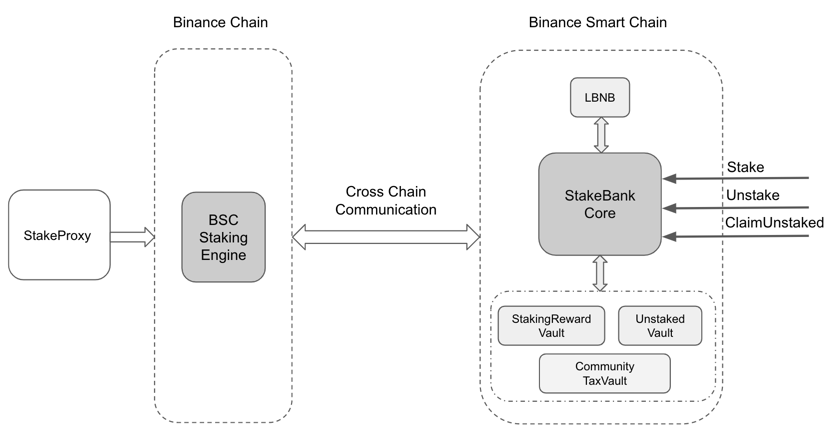
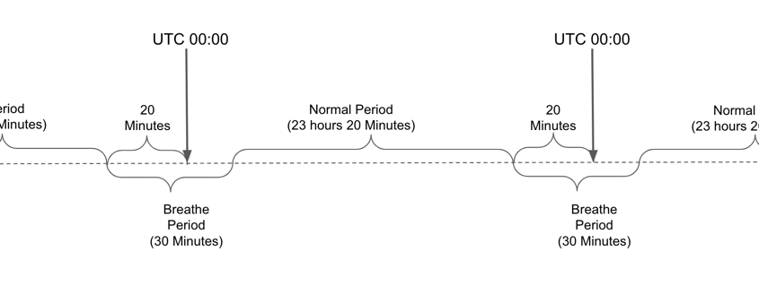

# StakingBNB

## Introduction about Native BSC(Binance Smart Chain) Staking Mechanism

The staking engine for BSC is on BC(Binance Chain). BSC users have to transfer their BNB to their BC wallets first. Then they can send staking transactions from their BC wallets. At each UTC 00:00, the BSC staking engine will distribute the previous received validator reward to all validator and delegators. Besides, according to the staking snapshot at UTC 00:00, the BSC staking engine will generate a cross chain package which specify all qualified BSC validators. Once the cross chain package is delivered on BSC, BSC will transfer the accumulated validator rewards back to BC and apply new validator set.

## Characteristics of Native BSC Staking Mechanism

1. During one day, staking time has no effect on validator set selecting result. 

    The BSC staking engine will take snapshots of validator voting power at UTC 00:00 and select the top 21 validators from the snapshot. Suppose a user stake some BNB at UTC 01:00, then the staking won't have any effect in this day, but it will be counted in the next day.

2. Delayed Staking Rewards

    Suppose a user stakes some BNB to a validator at the first day and the validator is in the validator set in next UTC 00:00, then the user will get the first staking rewards at the beginning of third day.

## Defects in Attending Native Binance Smart Chain Staking 

1. Lack liquidity: Once BNB is staked on BC, users will lose all liquidity of staked BNB.

2. Cost too much time to get staked BNB back. Currently, users have to wait for at least 7 days to get staked BNB back.

3. Require much effort on selecting validators with best APY.
   
   There are many factors which can affect the staking APY: 
   1. Validator commission rate. Validator can modify their commission rate at each 24 hours.
   2. Validator total voting power. For a validator, when its voting power is getting larger, then the proportion of a single staker will be getting less. As a result, the less reward will be distributed to the staker.
   3. Validator maintainer ability. Validator with poor maintainer ability is much easier to be jailed. If the validator is jailed, all stakers on the validator will get no reward.
   4. Other validator staking changes. If other validators is getting more and more voting power, then the current validator will be kicked out of top 21. To avoid that, a staker need to stake more asset or just move staking to other validators.
   
   All above factors will be changed with time, in order to get the best APY, users need to monitor changes about the above factors and dynamically calibrate staking strategy.

## What is StakingBNB

StakingBNB is a DeFi platform which can provide better staking BNB service than directly attending the native BSC(Binance Smart Chain) Staking. With StakingBNB, users will still get liquidity after staking and get staked BNB back much fast. Besides, the StakingBNB will offer the best staking reward APY by dynamically calibrating staking strategy.

### Architecture

#### Methods

1. `stake`: Stake BNB to get SBNB(Staking BNB Token)

2. `unstake`: Burn SBNB(Staking BNB Token) to get BNB. Users can't get staked BNB immediately. Users have to wait for there is enough BNB in unstakedBNBVault.

3. `claimUnstakedBNB`: Once there is enough BNB in unstakedBNBVault, anyone can call this method to claim unstaked BNB.

4. `claimStakingReward`: Claim staking reward. 

#### BCStakingProxy

`BCStakingProxy` is a centralized service. 

1. The service hold an address which is controlled by TSS. 
2. All staked BNB will be transferred to the TSS account by cross chain transfer.
3. It collects all stake and unstake event from StakingBNBAgent contract.
4. It will send stake or unstake transactions to BC(Binance Chain) at snapshot period(will be introduced later) from the TSS account. Suppose the total stake amount is 100:BNB and the total unstake amount is 50:BNB, the only 50:BNB will be staked. And the rest of them will be transferred to `UnstakedVault` by cross chain transfer.
5. It will take a snapshot of SBNB(Staking BNB Token) at first height in snapshot period, which is the basement of staking reward calculation.
6. During calculate staking reward period(will be introduced later), it will transfer received staking reward to `StakingRewardVault` and transfer matured unstaked BNB `StakingRewardVault`. Not all staking reward will be distributed to users. 1% of them will be left for staking transaction fee and cross chain fee, and 4% will be transferred to `CommunityTaxVault`.
7. During calculate staking reward period, it will also calculate reward for all stakers and write the reward amounts to `StakingBNBAgent` contract. If a staker reward is less than 0.01:BNB, then the reward won't be write into `StakingBNBAgent` contract. The tiny reward won't be just lost, BCStakingProxy will accumulate the reward for all tiny users.

#### Vaults

1. `StakingRewardVault`: Hold staking reward

2. `UnstakedVault`: Hold matured unstaked BNB

3. `CommunityTaxVault`: Hold 4% of staking reward for community development. Only governance can decide how to spend the BNB.

#### Periods

1. `Breathe Period`: BC will do some liquidation task at UTC 00:00, `StakingBNBAgent` will reject any operation in this period.

2. `Calculate Staking Reward Period`: The TSS account of `BCStakingProxy` will receive staking reward and matured unstaked BNB. `BCStakingProxy` will calculate reward to all stakers and transfer staking rewards to `StakingRewardVault`(95%) and `CommunityTaxVault`(4%). The rest 1% will be left for transactions fee and relay fee. The matured unstaked BNB will be transferred to `UnstakedVault`.

3. `Normal Period`: Users are fee to call methods: `stake`, `unstake`, `claimUnstakedBNB` and `claimStakingReward`.

4. `Snapshot SBNB Period`: `BCStakingProxy` will take a snapshot for SBNB holders at the first height of this period. Besides, `BCStakingProxy` will do stake, unstake and restake(redelegate) to achieve better APY.

### Characteristics

#### Liquidity

   After staking BNB, users will get equivalent amount SBNB. SBNB can be used in other defi platforms. We will also provide a mine pool. Users can stake their SBNB to get governence token.

#### Quick unstake

   If there are enough users come to staking BNB through our platform, users can get their unstaked BNB at the next UTC 00:00, while 7 days is required in directly staking.

#### APY

   `BCStakingProxy` will monitor all validator changes, analysis the changes and dynamically calibrate staking strategy to achieve better APY.

## Roadmap

Current implementation depends on a centralized service. Once Binance Chain and Binance Smart Chain support native cross chain staking interoperation, we will migrate our platform as soon as possible.

