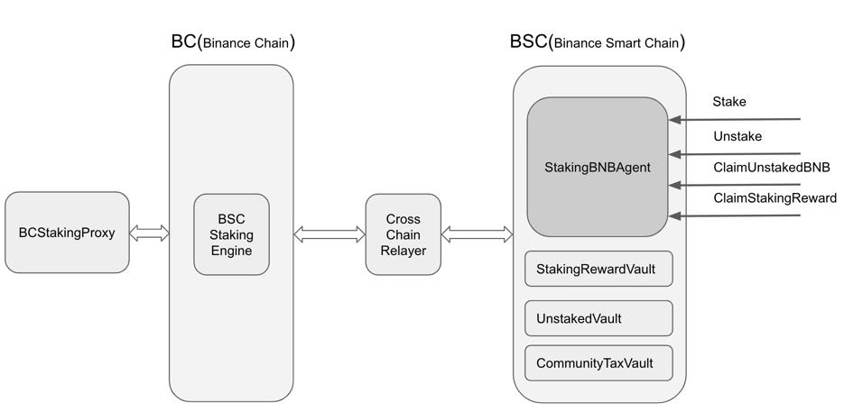
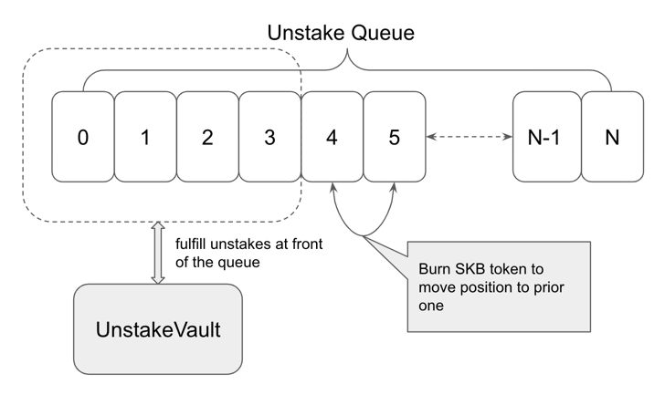
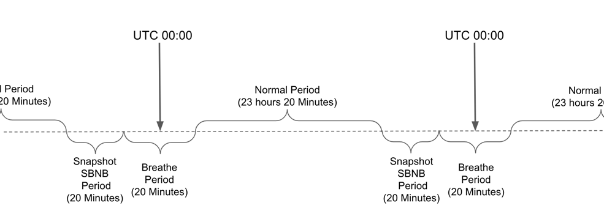

# StakeBank

## Architecture

## Methods

1. `stake`: Stake BNB to get LBNB

2. `unstake`: Burn LBNB to get BNB. Users can't get staked BNB immediately. a pending unstake will be created and insert into a queue. Users have to wait for there is enough BNB in `unstakedBNBVault`.

3. `accelerateUnstakedMature`: All pending unstakes will be inserted into the unstake queue. Only after all prior unstakes are fulfilled by the `unstakedBNBVault`, then current one can be claimed. This method can be used to move current unstake to the prior position. During this process, some SBF token from user wallet will be burned and the burn amount is proportional to the unstaked amount.
   
4. `batchClaimUnstakedBNB`: Once there is enough BNB in unstakedBNBVault, anyone can call this method to claim unstaked BNB.

5. `claimStakingReward`: Claim staking reward. 

## BCStakingProxy

`BCStakingProxy` is a staking proxy service which will build and send staking transactions to BC(Binance Chain).

1. The service hold an address which is controlled by TSS. 
2. All staked BNB will be transferred to the TSS account by cross chain transfer.
3. It collects all stake and unstake event from StakeBank contract.
4. It will send stake or unstake transactions to BC(Binance Chain) at snapshot period(will be introduced later) from the TSS account. Suppose the total stake amount is 100:BNB and the total unstake amount is 50:BNB, the only 50:BNB will be staked. And the rest of them will be transferred to `UnstakedVault` by cross chain transfer.
5. It will take a snapshot of stake amount for all users at first height in snapshot period, which is the basement of staking reward calculation.
6. After UTC 00:00, it will transfer received staking reward to `StakingRewardVault` and transfer matured unstaked BNB to `StakingRewardVault`. Not all staking reward will be distributed to users. 1% of them will be left for staking transaction fee and cross chain fee, and 4% will be transferred to `CommunityTaxVault`.
7. It will also calculate reward for all stakers and write the reward amounts to `StakeBank` contract. 

#### Vaults

1. `StakingRewardVault`: Hold staking reward

2. `UnstakedVault`: Hold matured unstaked BNB

3. `CommunityTaxVault`: Hold 4% of staking reward for community development. Only governance can decide how to spend the BNB.

#### Periods

1. `Breathe Period`: BC will do some liquidation task at UTC 00:00, `StakeBank` will reject any users' operations in this period.

2. `Normal Period`: Users are fee to call methods: `stake`, `unstake`, `accelerateUnstakedMature`, `batchClaimUnstakedBNB` and `claimStakingReward`.

3. `Snapshot Stake Period`: `StakeBank` will reject any users' operations in this period. `BCStakingProxy` will take a snapshot for stake amount of all users at the first height of this period. Then, `BCStakingProxy` will do stake, unstake and restake(redelegate) to achieve better APY.

## Roadmap

Current implementation depends on a `BCStakingProxy` service. Once Binance Chain and Binance Smart Chain support native cross chain staking interoperation, we will migrate our platform as soon as possible.

